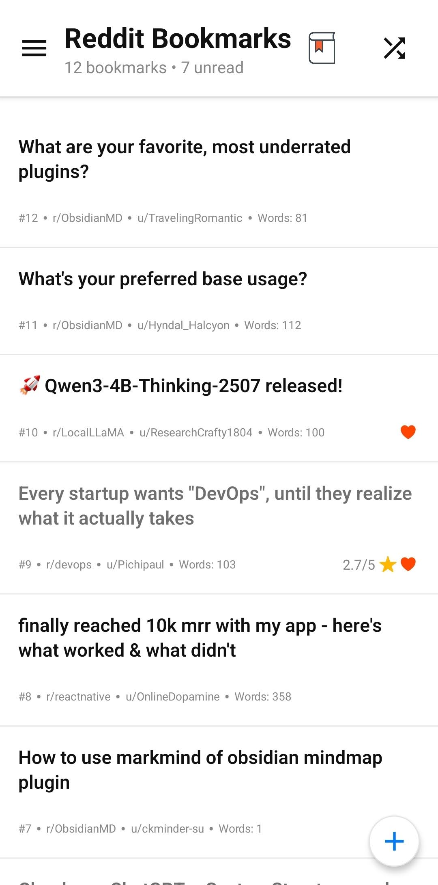
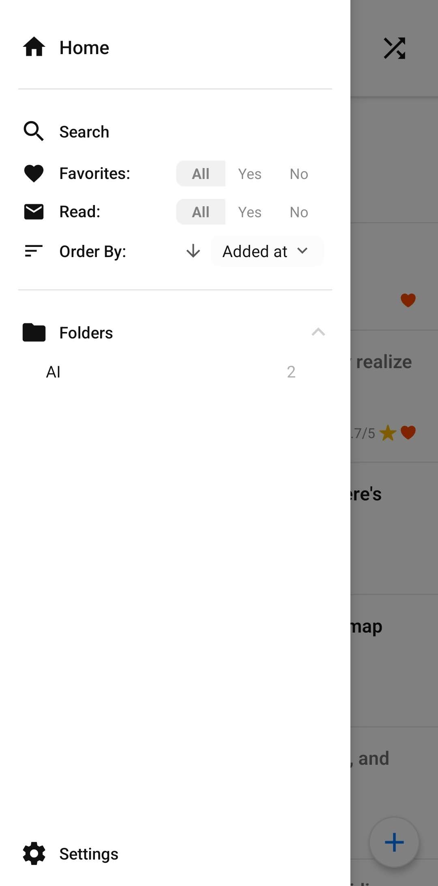

<p align="center">
    
</p>

# Reddit Bookmark App with AI Integration

As anyone who uses Reddit knows, saving and then later finding anything of interest is a nightmare! The saved posts screen is just a long list with no way of filtering it, resulting in endless scrolling for a post you may or may not have even remembered to save! There's also the sneaky 1000 saved posts cap, after which you need to either request your Reddit data or start unsaving posts. And god forbid you need to access anything offline or the post gets deleted.

The temporary solution I had was to copy and save interesting posts to my notes app. This worked but had its own issues. The main issue I kept running into while using my notes app was that the clipboard would truncate long text. Plus I would have to save the original link to find it again later. It just wasn't a good user experience. So I set out to fix that!

Having used a lot of React and TypeScript recently and been enjoying building some front ends, I wanted to explore building with React Native! Then, having built this, it gave me a great opportunity to try to integrate some AI functionality in a practical and useful way. I wanted to explore using some more local LLMs as well as cloud-hosted API endpoints, and how AI integration could feel natural, native and improve the user experience. I've detailed this specifically below.

### Project Objectives:

- A clean, minimalist design approach with intuitive user experience forefront 
- Offline storage
- Extensive search and filter functionality
- Post customisation and annotation (with read, favourites, ratings, and notes for later)
- AI feature integration

While this project was about learning some new tools, frameworks, and some AI, it was about building a genuine solution to a problem I had. And having some fun! An app I actually will use and enjoyed making. There is still plenty of room for improvement, optimisation, and refactoring. I don't pretend this is production-ready code. However, I wanted to share what I've built so far and highlight the AI integration since it's been so fun and rewarding!

<p align="center">
    
    
    
</p>

# Key Features 

### Post Customisation 

I wanted to be able to have a lot of options when it came to saving and then annotating posts. Posts can be favourited, marked as read/unread, and have a star rating. Posts can also be edited in-case I wanted to add my own corrections or remove filler text. I also added a custom notes section for keeping my own thoughts on a post separate to the post body. I even added a neat folder system with some nice UI for keeping posts organised within topics.

### Searching and Filtering 

Search and filtering were central to solving the original problem. The standard search and filtering options are featured: Searching body/title/author, sort by date/rating/read/favourite, etc. I also added a random button to take you to any post on your filtered list!

### Integration With Reddit API

Initially, I was scraping Reddit without using the official API, but I ran into issues with this such as rate limits and bot detection. This approach proved unreliable so I moved to use the official Reddit API.

### SQLite Database

I wanted posts to be saved on device both for offline access, but also redundancy (in-case posts were later taken down). For simple and reliable offline storage on mobile devices, SQLite was a no brainer. Well supported and not requiring any secondary service, storing the post data in an SQLite database also allowed for quick switching to other bookmark libraries and easy backup and restores.

A repository pattern was used as a layer between the database and service hooks for database logic isolation. This separation of concerns would allow simple switching of databases in the future.

I did face some challenges while using the SQLite database. For example, connections being automatically binned by the mobile backgrounding. This was addressed with a connection test when getting the database.

### UI Design Choices 

I had a lot of fun focusing on the design choices and building it with user experience in mind. Simple clean interface, intuitive buttons, and smooth interactions were all at the heart of the design of this app and I'm happy with the results! I wanted to avoid the clunky feeling of simple apps and paid a lot of attention to this aspect. I put a lot of work into making sure the lists and navigation felt smooth and intuitive and the results payed off. 

### React Native + Expo Go

React Native and Expo Go were an excellent choice for fast iterative development, allowing me to quickly build and test directly on my device. Having a background in React and TypeScript, I found the switch simple. Component based UIs, hooks, and state management are all familiar with the benefit of React Native providing access to native device APIs. There is much less new to wrap your head around than learning new tools such as Kotlin, Java, or Swift from scratch.

Expo extends the capabilities of React Native with excellent developer tooling. Testing on device is as easy as just scanning a QR code. Expo also allows for hot reloads and console debugging. It also adds useful libraries such as `expo-sqlite` for persistent local storage and `expo-secure-store` for simple and safe secret storage. 

By far the biggest struggle was working with memory management, specifically how React Native handles garbage collection and background process cleanup. Working with this helped me practice working on mobile environments and accessing objects safely. 

### Deduplication with Minhash

This was one interesting feature I'm proud of. Given the tendency on Reddit for reposts and cross-posts (posting again but on a different subreddit), I wanted to be able to detect posts I already had saved, beyond just a title match.

I experimented with two different simple hashing algorithms to match duplicate posts. Posts would be hashed into a signature representing its token set, then roughly similar posts could be matched, even when post formatting was slightly different.

**SimHash**
The first approach I tried was SimHash. While the SimHash was fast, it wasnt precise enough, and provided too many false positives.

**MinHash**
MinHash approached worked excellently for finding matches of posts with minor deviations. The post body Minhash signatures values were precomputed and added to the database to be later compared against any newly added post.

This was a good experiment in applying some data analytics and information retrieval techniques on mobile while constrained by mobile limitations.

# Implementing AI
## AI Summary Feature In React Native

Having been experimenting with a lot of AI recently, I wanted to integrate some simple AI functionality into my app. An AI summary feature seemed an obvious choice for this app and I aimed to integrate it in a natural and aesthetic way. 

I wanted to emulate the classic AI streamed response, the text that instantly displays when generating as the model writes. This gives the summary feature a fast and native feel, not waiting for a static blob of text to appear. The response time, especially in cases of long responses or when using slower self-hosted models, has a huge effect on user experience. Long delays can feel awkward or even concern the user something has gone wrong. Streaming the response also has the added benefit of letting the user start reading before the response has even finished generating.

In this section we will go over how to implement streamed chat completions in React Native, but the approach would be similar for React or other technologies. This was a surprisingly simple feature and ended up looking very clean and still taught me a lot about integrating AI features into applications.

### Streamed Chat Response

To achieve this streamed chat completion effect we will use an SSE (Server Sent Events) approach. SSE allows the server to send incremental data over a single long lived HTTP connection. We just make the request and listen to the JSON chunks returned. 

We will use the `POST /v1/chat/completions` endpoint provided by most OpenAI compatible APIs. We can enable the streaming of data by including `"stream": true` in our request body. Then the server sends incremental chunks as `text/event-stream` data until finally ending with `[DONE]` event.

Each chunk will look like:

```
data: {"choices":[{"delta":{"content":"Hello"}}]}
data: {"choices":[{"delta":{"content":" world!"}}]}
data: [DONE]
```

To open and manage the SSE connection we will use `EventSource`. Though the standard browser implementation of `EventSource` is GET only, we can actually use the version provided by the library `react-native-sse` because under the hood it is using XHR to implement this connection. This polyfill gives us auto-reconnect as well as being generally simple and lightweight. 

We will listen for each delta message and, unless it's the final `Done` message, we will append the new data to our stored ongoing response.

Our payload will contain the details we need to generate the message such as modelId, stream, messages, and max tokens.


```javascript
    const payload = {
      model: modelId,
      stream: true,
      messages: [
        {
          role: "user",
          content: bodyText + "----End of Text ---" + prompt,
        },
      ],
      max_tokens: maxTokens,
    };		
```

Here is our actual SSEChat service function:

``` javascript
import EventSource from "react-native-sse";

function startSSEChat(endpoint, apiKey, payload, onDelta, onFinish) {
  const es = new EventSource(endpoint, {
    method: "POST",
    headers: { 
	    "Content-Type": "application/json", 
	    "Authorization": `Bearer ${apiKey}`,
		Accept: "text/event-stream",
		
	},
    body: JSON.stringify({ ...payload, stream: true }),
  });
  
  es.addEventListener("message", (event) => {
    const raw = event.data?.trim();
    if (raw === "[DONE]") {
      es.close();
      onFinish?.();
      return;
    }

    try {
      const json = JSON.parse(raw);
      const delta = json?.choices?.[0]?.delta?.content || "";
      if (delta) onDelta(delta);
    } catch {
      console.log("Non-JSON frame:", raw);
    }
  });

  return es;
};

// The `onDelta` function is what we want to do, most likely update a local variable
function onDelta(delta) {
  setSummary((prev) => {
    const next = prev + delta;
    summaryRef.current = next;
    return next;
  });
}
```
 *Note: JavaScript for readability 

This approach has the benefits of low memory, fast responsiveness, auto reconnect, and quick cancellation by simply closing the SSE connection.

**Prompt**

The prompt was super simple, just `You are an assistant that summarises Reddit posts in 3-4 lines`. However, this could be changed in the app settings. I do want to experiment more with prompt engineering, but this feature only required a simple summarise request with no particular output requirements.

**UI State Machine**

The UI follows a simple four-state flow: `idle -> loading -> success | error`. This can be interrupted mid-loading and regenerated. The streamed text is stored temporarily and only saved to the post database when the post is saved.

Overall, though simple, this still shows how AI can be quickly but intentionally added as features for improving user experience with a fast and native feel delivering great user experience. 

## Further Investigations: Semantic Search and RAG

To expand the search capability and my own understanding, I also looked into using vector databases to allow for semantic search. This is a precursor to RAG and even a simple semantic search would have allowed for some more advanced post filtering.

To search by meaning, we would precompute chunked post data into vectors representing semantic meaning using a lightweight encoder such as `sentence-transformers/all-MiniLM-L6-v2` or even OpenAI’s text-embedding model. Then we could compare similarity using simple cosine similarity or dot-product to find closest matches. 

I hypothesised a hybrid approach where I offload the embedding to a server, using either a self-hosted endpoint, or a cloud one. Then the best option for storing the embedding vector would have been stored in a blob in an SQL table to keep the app buildable in Expo. There exist other on-device vector storage options for mobile but none for Expo I could find. Lastly cosine similarity functions could have been implemented from scratch to keep the search functionality offline. The issue with this is that search query would also need embedding, so could not be completely offline. It would have allowed searching for similar posts using the already computed embeddings though! 

I did also look into using `react-native-fast-tflite`, a high-performance TensorFlow Lite library for React Native. A simple embedding model could have been saved to the device and most modern phones could handle small chunk embeddings, especially with a small embedding model. I have yet to experiment with this as I just ran out of time on this project and this would have required a large chunk of development and testing effort. I do hope to revisit this soon though!

The next step after semantic search would have been to implement RAG (Retrieval-Augmented Generation), allowing the post database to be the knowledge base for an LLM. By injecting results from a semantic search into the prompt for an LLM, users could query and interact with their database. 

While I made some progress into looking into this, the challenges I faced were available libraries, large refactors, and computational requirements on mobile. Especially generating the embeddings and the searching across large datasets. As I said I did consider precomputing embeddings server-side but this project was quickly growing out of hand. There are also the model hosting constraints and data privacy issue faced with sending data across networks and to remote llm's if this app was to be made public, but luckily this remains just a little passion project.

It would have been very interesting to investigate some full RAG implementations and architectures, however I think this would be best suited for future projects, especially where I'm not constrained by mobile capabilities. Whether that be a remote AI service for this app or a completely new project all together!
